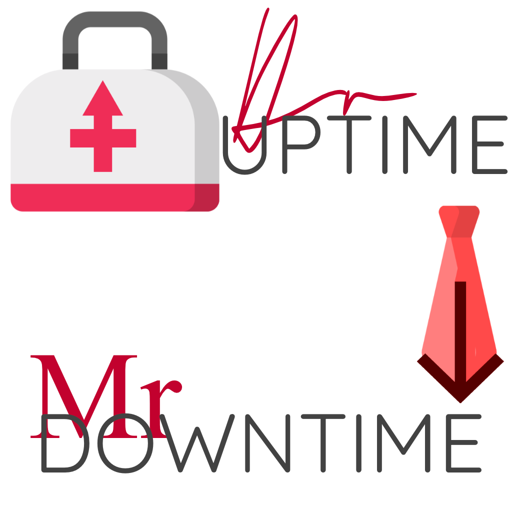

  

  <h2 align="center">Dr Uptime & Mr Downtime</h2>
 
<i>BloomTech Unit 5 Project</i>

<h5 align="center">This application aims to allow system administrators the ability to monitor web applications and APIs.</h5>

  

     
    
    
    
     
    

